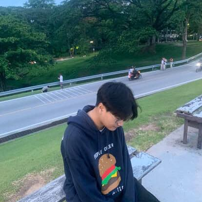
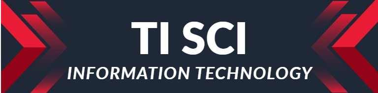

<!-- =========================
     HERO / BANNER
========================= -->

  

<h1 align="center">Thanapat Siriprapasuk</h1>

  <strong>Inter Back-end Developer</strong> · Spring Boot · Java · Flutter  

<i>"Turning ideas into delightful, scalable software."</i>

<!-- Neon Gradient Bar -->

  

<!-- Wavy Divider -->

  

<!-- =========================
     QUICK BADGES
========================= -->

  
  
  
  

<!-- =========================
     ABOUT ME (collapsible)
========================= -->

  
<b>🔎 About Me</b>

- 🌍 Based in **Chiang Mai, Thailand**  
- 🌱 Learning **Mobile apps & Web Dev (Flutter + Spring)**  
- 🛠 Daily stack: **Java · Spring Boot/MVC · Flutter · JavaScript · C++**  
- 🎯 2025 Goal: **Ship an OSS library / impactful side-project**  
- 📫 Contact: **safe.pmk32@gmail.com**

<!-- =========================
     TOOLBOX: CHIP BOARD
========================= -->
<h3>🧰 Toolbox</h3>

  <!-- Core -->
  
  
  
  
  
  
  <!-- Infra/Tools -->
  
  
  
  
  

<!-- =========================
     FEATURED PROJECTS: CARDS
========================= -->
<h3>✨ Featured Projects</h3>

<table>
  <tr>
    <td width="50%">
      <h4>Assessment API (Spring Boot)</h4>
      
RESTful CRUD · Search by type/name · <code>/by-type/{type}</code> custom endpoint

      

        
        
        
      

    </td>
    <td width="50%">
      <h4>Project2025 Mobile App</h4>
      
Flutter client · Self-assessment UI · Local/remote baseURL config

      

        
        
        
      

    </td>
  </tr>
  <tr>
    <td width="50%">
      <h4>Clean Architecture Demo</h4>
      
Layered modules · DTO/Mapper · Testable patterns

      

        
        
        
      

    </td>
    <td width="50%">
      <h4>DevOps Basics Lab</h4>
      
Dockerized services · CI/CD scaffold · Local K8s playground

      

        
        
        
      

    </td>
  </tr>
</table>

<!-- =========================
     NOW / FOCUS
========================= -->

  
<b>🗺️ What I'm focusing on now</b>

- Polish a production-grade Spring Boot starter
- Publish a Flutter package for clean form state
- Write dev notes: pragmatic REST, DTO mapping, and testing cheatsheets

<!-- =========================
     STATS ZONE
========================= -->
<h3>📊 Stats & Activity</h3>

  
  
  

<!-- Contribution Snake (dark) -->

  

<!-- =========================
     CONTACT / FOOTER
========================= -->
<h3>🤝 Let’s Connect</h3>

> “Great products are built by great people working together.”

- 💌 Email: **safe.pmk32@gmail.com**  
- 🐦 DM me on https://www.facebook.com/TnpSafe/
- 🔗 LinkedIn: [add your link here  ](https://github.com/SORSAFEXXD)

<!-- Neon Wave Footer -->

  

